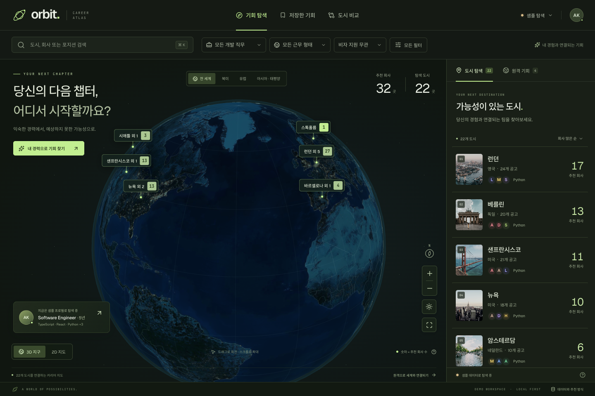

# ORBIT · 내 커리어의 다음 좌표

이력서와 희망 조건을 바탕으로 세계의 개발자 채용 기회를 탐색하는 로컬 웹 앱입니다. 3D 지구에서 도시별 **추천 회사 수**를 보고, 회사와 공고를 살펴본 다음 저장하거나 도시를 비교할 수 있습니다.



[모바일 화면 보기](docs/orbit-mobile.png)

## 실행

Node.js **22.12 이상**이 필요합니다.

```bash
npm ci
npm run dev
```

**http://localhost:5173** 에서 열립니다. 계정이나 API 키는 필요하지 않습니다.

포트를 바꾸려면:

```bash
PORT=5174 npm run dev
```

처음에는 **샘플 데이터와 샘플 프로필**로 시작합니다. 상단의 **샘플 탐색 → 공개 채용공고**를 선택하면 실제 Greenhouse·Ashby·Lever·SmartRecruiters 게시판을 함께 조회합니다. 인터넷이 필요하며 전체 수집에는 1분 이상 걸릴 수 있지만, **먼저 확인된 회사의 공고부터 탐색**할 수 있습니다. 나머지를 수집하는 동안 검색·저장·메모 작성을 계속할 수 있습니다.

지도 텍스처, 국가 경계, 도시 사진, 글꼴, PDF 분석 자산을 로컬에서 제공합니다. 패키지 설치가 끝나면 샘플 탐색과 이력서 분석은 인터넷 연결 없이 사용할 수 있습니다.

## 할 수 있는 일

- **3D 지구 / 2D 지도:** 회전, 확대·축소, 지역 이동, 주간·야간 전환, 도시 선택. 가까운 도시는 묶고 확대하면 분리합니다.
- **도시 목록:** 지구 뒤편의 도시까지 함께 탐색합니다. 회사 수, 기술·경력 일치, 공개 연봉으로 정렬할 수 있습니다.
- **내 프로필:** PDF, DOCX, TXT, MD 또는 경력 텍스트를 읽고 기술과 경력 연수를 추출합니다. 추출 결과를 직접 수정하고 희망 직무, 근무 형태, 비자, 연봉, 거주 국가를 설정합니다.
- **검색과 필터:** 회사·포지션·도시·기술·원격근무 국가 검색, 직무, 근무 형태, 비자, 고용 형태, 보상 범위, 명시된 원격근무 지역.
- **직무 분류와 근거:** 개발·컴퓨팅 엔지니어링과 컴퓨터·AI 연구 공고를 탐색합니다. 제목·공개 부서·직급과 연구 업무의 근거를 확인하며, 여러 직무가 명시되면 각각의 필터에서 찾을 수 있습니다. 세부 직무를 특정하지 못한 공고도 따로 탐색합니다.
- **빈 결과에서 이어 찾기:** 같은 조건의 다른 도시·원격 기회·기타 근무지로 이동하거나, 바꿀 조건과 예상 회사·공고 수를 먼저 확인합니다. 선택한 변경만 적용하고 실행 취소할 수 있습니다.
- **회사와 공고:** 관련 공고를 회사별로 묶고, 경험이 맞는 이유와 부족하거나 미확인인 조건을 표시합니다. 회사 카드를 펼치면 추천 순서대로 10개씩 탐색하고 각 페이지에서 상세 열람·저장을 할 수 있습니다.
- **원격 기회:** 원격 공고를 별도로 보여주고 공고에 명시된 근무 지역과 거주 국가를 비교합니다.
- **기타 근무지:** 제공 도시에 연결되지 않은 공고도 원문 근무지로 검색하고 열람·저장합니다. 국가명만 있거나 위치가 불명확한 공고를 임의의 도시나 원격근무로 분류하지 않습니다.
- **취업 자격 조건:** 비자 지원의 적용 범위, 취업 허가·시민권·거주 요건·보안 인가·수출 통제 조건을 원문과 함께 확인합니다. 필수로 명시된 조건과 우대 사항을 구분합니다.
- **저장:** 최대 500개 공고의 스냅샷, 메모, 지원 완료 표시, 삭제 실행 취소, CSV 내보내기, JSON 백업·복원. 공고별로 비동기 저장하며, 저장 중·완료·실패와 재시도를 표시합니다. 가져올 기록은 현재 내용과 비교한 뒤 선택할 수 있습니다.
- **저장 공고의 게시 상태:** 직접 확인하면 최근 공개 목록의 게시 여부와 저장 내용의 차이를 표시합니다. 게시판 장애·목록에서 미확인·내용 차이를 구분하고 해당 상태로 저장 목록을 좁힐 수 있습니다.
- **도시 비교:** 최대 3개 도시의 회사 수, 공고 수, 공개 연봉 중앙값, 비자 지원, 하이브리드 공고, 공통 기술을 비교합니다.
- **모바일과 키보드:** 모바일 전용 탐색 메뉴, 지도에서 목록으로 이동, 키보드 지도 조작, 모달 포커스 관리, 동작 줄이기 설정을 지원합니다.

검색창은 `⌘K` / `Ctrl+K` 또는 `/`로 바로 이동합니다. 3D 지도에 포커스를 두고 방향키로 회전, `+` / `-`로 확대·축소, `Home`으로 초기화할 수 있습니다.

회사 카드의 **전체 N개 공고 보기**를 누르면 전체 수와 현재 표시 범위를 보여줍니다. 긴 목록의 위·아래에서 처음·이전·다음·마지막 페이지로 이동하거나 공고를 접을 수 있습니다. 페이지 이동 후 키보드 포커스는 새 페이지의 첫 공고로 이동합니다. 검색·추천·회사 수 집계에는 조건에 맞는 전체 공고를 사용하고, 검색 결과나 순서가 바뀌면 첫 페이지부터 보여줍니다. 상세를 닫거나 공고를 저장한 뒤에는 보던 페이지를 유지합니다.

모바일에서는 도시 비교·공고 저장·페이지 이동 버튼을 넓게 누를 수 있고, 공고 제목과 조건 설명을 더 큰 글자로 표시합니다. 필터 안내는 검색 도구 아래에서 전체 문구를 보여주며 공고 위를 덮지 않습니다. **초기화**를 누르면 검색 입력으로 포커스가 돌아갑니다. 키보드로 목록을 이동할 때는 하단 메뉴와 기기의 안전 영역 위로 선택한 항목이 보이도록 여백을 확보합니다.

데이터 모드, 검색어와 필터, 선택 도시·원격·기타 근무지 탭, 2D/3D·주야간 보기, 도시 정렬을 기억합니다. 같은 브라우저에서 **같은 주소**로 다시 방문하면 마지막 탐색을 이어갑니다. 공개 모드는 서버에 공고를 다시 조회하며, 연결 중·연결 실패·실제 결과 없음은 따로 표시합니다. 조회 중에도 데이터 화면에서 샘플로 전환할 수 있습니다.

결과가 없으면 현재 조회한 공고로 **최대 3개의 조건 변경안**을 계산합니다. 선택한 도시·원격·기타 근무지 범위에서 회사·공고 수를 확인하며, 여러 조건을 함께 바꿔야 할 때도 변경 항목을 모두 표시합니다. 비자 미확인·지원 없음, 거주 국가 범위 밖의 원격 공고, 연봉 미공개·별도 보상을 포함하는 변경은 그 의미를 함께 안내합니다. 버튼을 누르기 전에는 조건을 바꾸지 않으며, 다른 조건·프로필·거주 국가는 유지합니다. 실행 취소는 이후에 사용자가 직접 수정한 값은 보존합니다.

입력 기술과 겹치는 자격 기술이 없어 제외된 공고는 프로필 확인을 안내합니다. 조회 대기·연결 오류를 필터 때문에 생긴 빈 결과로 표현하지 않으며, 수집 범위에 공고가 없으면 후보 수를 만들어내지 않습니다. 후보 수는 이전 정상 조회 결과를 포함할 수 있는 현재 카탈로그 기준이고, 전체 채용 시장의 공고 수는 아닙니다.

저장 목록의 **게시 상태 확인**은 탐색 모드와 조건을 바꾸지 않습니다. 저장한 공고의 ID·메모·프로필을 서버에 보내지 않고, 전체 대상 게시판의 공개 목록을 받아 브라우저에서 비교합니다. 포지션·직무 분류와 근거·근무지·근무/고용/비자/취업 자격·보상·기술/경력·본문·지원 링크의 표시 내용이 달라졌는지 확인하며, 저장한 기록은 자동으로 덮어쓰지 않습니다. CSV에는 지원 상태와 공개 게시 상태, 확인 시각, 내용 비교 결과를 별도로 남깁니다. 저장 내용의 원래 조회 시각, 내보낼 당시 조회 기록의 상태와 내보낸 시각도 포함합니다.

탐색 대상 직군이 아닌 것으로 재분류된 저장 공고는 **현재 탐색 범위 밖**으로 안내하고 공고·메모·지원 기록을 계속 보관합니다. 전체 공개 목록에 있으면 게시 확인이 가능하며, 탐색 목록에서 제외되었다고 채용 종료로 판단하지 않습니다. 상세와 CSV에서 탐색 직군과 그 근거도 확인할 수 있습니다.

이런 공고에는 세부 개발 직무와 희망 개발 직무 일치를 적용하지 않습니다. 저장 검색·상세·CSV는 현재 직군을 사용하고, 공고에 명시된 기술·경력·근무 조건은 계속 비교합니다. 원래 부서 정보와 JSON 백업의 이전 분류 기록도 유지합니다.

게시 상태는 실시간 채용 가능 여부가 아닙니다. 마지막 정상 목록 조회로부터 30분이 지나거나 해당 게시판 조회가 실패하면 **확인 필요**로 바뀝니다. 공개 목록에서 찾지 못해도 채용 종료로 단정하지 않으며 원문 확인을 안내합니다. 전체 공개 ID가 없는 이전 캐시나 출처 게시판을 확인할 수 없는 오래된 저장 기록으로는 목록에서 사라졌다고 판단하지 않습니다. 화면을 새로 열면 게시 상태를 다시 확인해야 합니다.

## 데이터와 추천 기준

### 샘플과 공개 공고

샘플은 **22개 도시, 32개 실제 회사 이름을 활용한 체험용 시나리오**입니다. 공고·연봉·비자·근무 조건은 실제 채용 사실을 나타내지 않습니다. 샘플 공고의 링크는 실제 회사의 채용 페이지로 연결됩니다.

공개 모드는 다음 **22개 회사의 공개 게시판 API**를 조회합니다.

| 출처 | 대상 회사 |
| --- | --- |
| Greenhouse | Stripe, Figma, Vercel, Cloudflare, Datadog, MongoDB, Airbnb, GitLab, Anthropic, Intercom, Asana |
| Ashby | Linear, DeepL, n8n, Supabase, Mistral AI, Jane |
| Lever | Spotify, Contentsquare |
| SmartRecruiters | Canva, Grab, Wise |

- 게시판 조회 시점에 공개된 개발·컴퓨팅 엔지니어링과 컴퓨터·AI 연구 공고를 사용합니다. 제목·공개 부서·직급을 확인해 고객 지원·솔루션, 관리직, 기계·제조 등 다른 직군을 제외합니다.
- `Applied Scientist`처럼 일반적인 연구 직함은 해당 공고의 업무·자격에서 알고리즘·소프트웨어·모델 개발 등 컴퓨팅 근거를 확인합니다. 회사가 AI 기업이거나 부서명에 AI가 있다는 이유만으로 연구직을 포함하지 않습니다. UX 연구·채용 연구·화학 실험 등 명시적으로 다른 분야인 연구직은 구분합니다.
- `Copywriter, Developer`, `Technical Writer / Developer Educator`처럼 개발자를 대상으로 글·문서를 작성하는 직무는 기타 직군으로 구분합니다. 제목의 실제 직무와 대상 독자·제품을 나누어 확인하며, `Marketing Engineer`처럼 마케팅 부서에서 개발하는 명시적인 엔지니어 직무는 포함합니다.
- Greenhouse의 공개 `Job Level` 등에 명시된 관리자 여부를 사용하며 `Lead`나 멘토링만으로 관리직으로 판단하지 않습니다. `Salesforce Developer`, 지원 도구를 만드는 엔지니어, 펌웨어·하드웨어 보안 개발직을 영업·고객지원·물리적 설계직과 혼동하지 않도록 구분합니다.
- Ashby의 `isListed: false` 공고는 제외합니다. Lever는 페이지를 끝까지 읽고 중복 ID를 제거하며, 중간 페이지가 실패하면 일부 결과로 기존 목록을 덮어쓰지 않습니다.
- SmartRecruiters는 `destination=PUBLIC`로 모든 목록 페이지를 확인한 뒤 개발·연구 후보의 본문을 조회합니다. 본문이 필요한 일반 연구 직함도 확인하며, 제목이 같아도 다른 지역의 게시 ID는 유지합니다. 유효한 상세 응답에 `active: false`나 내부 게시 상태가 명시되면 해당 ID를 공개 목록에서 제외합니다. 통신 실패·불완전한 페이지·회사나 ID 불일치는 회사 전체의 새 결과를 반영하지 않습니다.
- SmartRecruiters 요청은 한 서버 프로세스에서 회사별로 같은 대기열을 사용합니다. 시작 간격 200ms, 최대 동시 요청 4개, 개별 요청 25초·게시판 전체 120초 한도를 두며 `429`·`Retry-After` 대기는 다른 대기 중인 요청에도 적용합니다.
- Greenhouse 목록 요청에 `pay_transparency=true`를 추가해 반환되는 급여 구간·통화·제목·설명문을 함께 읽습니다. 구조화된 구간이 없으면 공고 본문의 보상 문구를 확인합니다.
- SmartRecruiters의 `compensation`에는 기본 급여 여부가 없으므로 통화·금액·지급 기간을 보존하되 비교 가능한 기본 연봉으로 단정하지 않습니다. `typeOfEmployment`는 공개 표시 이름을 사용하며 내부 ID `permanent`만으로 `Full-time` 공고를 기간 제한 없는 고용으로 바꾸지 않습니다.
- 회사별 마지막 정상 조회 결과를 검증해 30분 캐시합니다. 수동 새로고침은 게시판별로 최소 1분 간격을 둡니다.
- 사용 가능한 캐시는 먼저 보여주고 새 결과는 회사별 전체 목록의 검증이 끝난 뒤 반영합니다. 진행 표시의 숫자는 이번에 조회할 회사 중 응답 처리가 끝난 회사 수이며, 남은 시간이나 성공률이 아닙니다. 조회 중·실패·이전 조회 공고를 구분합니다.
- 일부 게시판의 조회가 실패하면 마지막 정상 확인으로부터 24시간 이내인 해당 회사의 공고를 유지합니다. 목록·상세·저장·도시 비교에서 이전 조회 결과임을 구분하고 원래 확인 시각을 보존합니다. 정상 응답이 빈 목록이면 기존 공고를 제거합니다.
- 오류가 반복되면 재시도 간격을 늘립니다(기본 1분, 임의 지연을 포함해 최대 30분). 게시판이 더 늦은 `Retry-After`를 지정하면 그 시각을 따릅니다. 재시도 대기 상태는 서버를 다시 시작해도 유지됩니다.
- 공고가 여러 도시에 해당하면 각 도시에 표시하고, 전체 회사 수에서는 중복을 제거합니다.
- 직무별 위치 필드와 해당 공고의 위치 메타데이터를 우선합니다. `Hybrid`처럼 위치가 없는 경우에만 **그 공고에 연결된 오피스**를 확인합니다. 회사 본사를 임의로 사용하지 않습니다.
- 게시 도시와 본문에 명시된 현재 근무지가 다르면 근거를 함께 확인합니다. `RELOCATE to Sydney`, `Internship in Paris or London`처럼 제목과 본문이 같은 이전·인턴십 근무지를 명시하면 해당 도시에 연결하고 원래 게시 위치를 보관합니다. 현재 근무지에 지원자 거주지나 이후 정규직 전환 장소를 섞지 않습니다.
- 제목으로 해소할 수 없는 명시적 위치 충돌은 **기타 근무지**에서 확인 필요로 안내합니다. 상세·저장·CSV·JSON에 원래 게시 위치, 본문의 근무지와 원문 근거를 유지합니다. 기존에 저장한 공고도 같은 기준으로 읽으며 ID·메모·지원 상태·조회 시각을 보존합니다. 겹치는 복수 근무지나 원격근무 지역은 이 규칙으로 변경하지 않습니다.
- Ashby의 기본·추가 근무지와 구조화된 주소, Lever의 `allLocations`를 읽습니다. 주소에 국가가 있으면 같은 이름의 다른 도시로 연결하지 않습니다.
- 근무·고용 형태는 `Workplace Type`, `Location Type`, `Employment Type`, `Time Type` 같은 공고별 필드를 우선합니다. 본문을 사용할 때는 해당 직무에 대한 명시적인 문장만 반영합니다. 특정 오피스에서 하이브리드 일정으로 근무한다는 직무별 문장도 읽으며, 회사 전체의 복지나 유연근무 소개로 조건을 추정하지 않습니다.
- 제공 도시에 연결되지 않은 개발 공고도 수집해 **기타 근무지**에서 보여줍니다. 원문 위치를 유지하고, 임의의 도시나 원격 공고로 바꾸지 않습니다. 회사 전체 집계·검색·저장·게시 상태 비교에도 포함합니다.
- 기타 근무지는 **전 세계**에서만 표시합니다. 원문 지역명으로 검색할 수 있고 직무·보상·비자 등의 조건은 계속 적용합니다. 지역 필터를 해제해야 결과가 생기는 경우 변경 전·후 수치를 안내하고 사용자가 선택할 때만 적용합니다.
- 데이터 화면에서 최근 조회·이전 조회·미확인 게시판, 회사별 마지막 정상 확인과 실패 시각, 재시도 가능 시각을 확인할 수 있습니다. 서버 조회와 열린 화면 모두 회사별 원래 시각을 기준으로 24시간을 넘긴 결과를 추천에서 제외합니다.

조회 가능한 게시판과 공고 수는 계속 바뀝니다. 화면의 **데이터와 추천 방식**에서 출처, 제공 도시, 조회 시각, 게시판별 상태를 확인할 수 있습니다. 이 앱의 22개 도시는 지도 표시 범위이며, 각 도시의 전체 채용 시장을 수집했다는 뜻이 아닙니다.

화면을 계속 열어 두어도 정상 확인 후 **30분**이 지난 공고는 이전 조회로 바뀝니다. **24시간**을 넘기면 회사 수·지도·목록·도시 비교에서 제외하며, 모든 기록의 확인 기간이 지나면 검색 결과 없음 대신 재조회를 안내합니다. 탭에 돌아오거나 뒤로 가기로 화면이 복원될 때도 기기 시각으로 다시 확인합니다. 시간 경과를 게시판 장애나 모집 종료로 표시하지 않으며, 자동으로 외부 게시판을 조회하지 않습니다. 검색 조건과 저장한 공고·메모·지원 상태는 유지하고, 저장 목록과 열려 있는 상세에서는 오래된 조회 기록임을 표시합니다.

공개 카탈로그와 게시 상태의 정상 응답은 브라우저 HTTP 캐시에 저장할 수 있지만 **재사용할 때마다 서버에 확인**합니다. 서버가 수집·재시도·만료 규칙을 확인한 뒤 내용이 같으면 본문 없는 `304`로 응답합니다. 공고의 원래 조회 시각과 게시 상태의 유효 기간은 연장하지 않으며, 오류 응답은 저장하지 않습니다. 서버에 연결할 수 없으면 캐시를 최신 조회 결과로 대신 사용하지 않습니다.

수집 중에는 완료된 회사의 변경분만 추가로 받습니다. 진행 확인은 서버의 현재 상태만 읽으며 외부 게시판의 새 조회를 시작하지 않습니다. 완료·샘플 전환·연결 오류 시 브라우저의 진행 확인을 멈추고, 오류가 나면 이미 받은 공고를 유지한 채 직접 재연결할 수 있습니다. 미완료 결과로 검색 조건 변경안을 권하지 않습니다. 진행 응답은 HTTP 캐시에 저장하지 않으며 [수집 진행 API 계약](docs/catalog-progress.md)에 기존 응답과의 호환·취소·실패 동작을 정리했습니다.

### 설명 가능한 로컬 매칭

외부 AI API 대신 공고의 자격 항목, 입력한 기술, 희망 직무, 경력 연수를 비교합니다. 기술·직무·경력으로 내부 정렬 순서를 계산하며 **합격 확률을 표시하지 않습니다**.

- 공개 공고의 기술을 **필수로 명시·자격 항목·우대 사항·업무·본문 언급**으로 구분합니다. `Who you are` 같은 일반 자격 항목을 모두 필수라고 단정하지 않으며, 회사 소개·복지의 기술 언급을 지원자의 요구 기술로 사용하지 않습니다.
- 필수·자격 항목의 기술 일치를 중심으로 정렬합니다. 확인된 우대 경험은 추가 이점으로 반영하며, 우대 기술이 없다는 이유로 필수 조건의 부족을 표시하거나 점수를 낮추지 않습니다. 업무·본문에서만 언급한 기술은 검색할 수 있지만 기술 추천 점수에는 넣지 않습니다.
- `Python 또는 Java`처럼 분명한 선택 조건은 하나를 확인하면 다른 기술을 부족한 조건으로 표시하지 않습니다. 여러 필수·선택·예시가 섞인 문장은 관계를 임의로 단순화하지 않고 원문 확인을 안내합니다.
- 요구 경력과 우대 경력을 따로 읽습니다. 입사 후 목표 기간·회사 연혁·학업 기간을 요구 경력에 넣지 않으며, 학력이나 선택 경로에 따라 연수가 달라지면 하나의 최소 경력으로 판단하지 않습니다. 입력한 **전체 경력 연수**만 비교하므로 기술·직무별 경력이나 학력 조건 충족을 보장하지 않습니다.
- 이력서에서 개인 경력 연수를 확인하지 못하면 **미입력**으로 둡니다. 그대로 탐색할 수 있고, 이때 경력 점수와 경력의 충족·부족 설명은 적용하지 않습니다. 직접 입력한 **0년**은 미입력과 구분합니다.
- 프로필 경력은 **0~50년의 소수**도 입력할 수 있습니다. `3.5 years`, `0.5년 경력`, `총 경력 2년 6개월`처럼 명시된 기간을 읽고, 날짜·기간 범위·서로 다른 경력을 임의로 합산하지 않습니다. 전체 경력이 따로 명시되면 이를 우선하며, 불명확한 연수는 확인을 요청합니다. 입력값을 몰래 반올림하거나 범위 끝으로 바꾸지 않고 오류를 안내합니다.
- 상세에서 기술·경력의 분류와 원문을 확인할 수 있고, 카드에서도 필수·자격·우대 중 어떤 경험이 연결되는지 구분합니다. 이 근거는 저장·재방문·CSV에도 유지됩니다.
- 공개 공고의 직무는 **제목의 표기를 우선**합니다. 제목으로 분류할 수 없으면 해당 공고의 공개 부서·팀을 참고하며, 회사 업종이나 사용 언어만으로 직무를 정하지 않습니다. `Software Engineer`를 자동으로 풀스택으로 분류하지 않습니다.
- 컴퓨팅 연구직으로 확인했으나 제목·부서로 세부 직무를 정할 수 없는 경우, 검증한 연구 업무·자격 문구의 머신러닝·언어 모델 등 근거로 AI·머신러닝을 보완합니다. 이 본문 보완은 연구직에 한정하며 회사 소개·우대 문구만으로 적용하지 않습니다.
- 여러 직무가 명시된 공고는 각 직무의 필터와 희망 직무 비교에 포함합니다. 한 공고나 회사를 중복 집계하지 않으며, 분류에 사용한 제목·부서·연구 업무 원문을 상세·저장·CSV에서 확인할 수 있습니다.
- 세부 직무를 확인하지 못하면 **세부 직무 미확인**으로 남기고 희망 직무 일치 점수를 주지 않습니다. 해당 공고는 **모든 개발 직무** 또는 **세부 직무 미확인** 필터에서 찾을 수 있습니다. 두 경우 모두 프로필의 자격 기술 일치 조건을 적용하며, 특정 직무를 명시적으로 선택한 경우에는 기술이 달라도 탐색할 수 있습니다.
- 직무·비자·근무 형태·고용 형태·급여·원격근무 지역은 필터로 적용합니다.
- 비자는 **지원 명시·조건부 지원·지원 없음·미확인**을 구분합니다. 특정 국가·직무나 기존 비자 스폰서십 변경에 한정된 지원도 조건부로 표시합니다. “지원 명시 · 조건부 포함”으로 조건이 있는 지원 공고까지 살펴볼 수 있고, “조건부 제외”는 제한 조건이 감지된 공고를 제외합니다. 미확인은 지원 가능으로 추정하지 않습니다.
- 비자와 이주 지원을 함께 제공하는 명시적인 문구도 읽습니다. 기존 스폰서십 변경을 지원하는 공고는 목록·상세·저장 화면에서 지원 유형을 안내하고, 현지 지원자·이주 지원 제외 등 원문의 적용 조건을 함께 보존합니다. 현재 인턴십의 지원과 이후 별도 채용 단계의 지원은 구분합니다.
- 공고 상세의 **채용 조건의 원문 근거**에서 비자·근무·고용 형태의 판단에 사용한 문구를 확인할 수 있습니다. 수출 허가에 대한 스폰서십은 취업 비자로 해석하지 않습니다. 비자 지원 명시는 발급 보장이 아닙니다.
- **취업 자격과 추가 조건**에서 기존 취업 허가, 시민권, 주별 거주 제한, 보안 인가와 수출 통제의 명시적인 문구를 확인합니다. 필수·적용 조건·우대·원문 확인을 구분하며, 보유하거나 취득할 수 있다는 선택 조건은 원문으로 보존합니다. 차별 금지 안내나 개인정보 수집 항목은 지원 요건으로 사용하지 않습니다.
- 거주 국가는 지리적인 원격근무 범위와만 비교합니다. 국적·취업 허가·보안 인가 보유 여부를 입력받거나 추정하지 않고, 이에 따라 추천 점수를 바꾸거나 공고를 자동 제외하지 않습니다. 조건을 추출하지 못한 공고가 제한 없는 공고라는 뜻은 아닙니다. 취업 자격의 근거는 저장·재방문·CSV에도 유지됩니다.
- `Full time`은 **풀타임**, `Permanent`는 **기간 제한 없음**으로 구분합니다. 근무 시간이나 계약 기간만으로 정규직 계약이라고 단정하지 않으며, 파트타임·계약직·인턴·임시직도 구분합니다.
- `Europe`, `AMER`, `APAC`는 지역 탐색에 활용하지만 근무 가능한 국가 목록으로 확장하지 않습니다. 원격 공고의 사무실 주소도 국가별 근무 허용으로 해석하지 않습니다. `Global`·`Worldwide` 명시와 확인된 국가만 기본 원격근무 지역 필터에 반영하며, 국가가 일치해도 취업 허가·주별 제한 등은 별도 확인이 필요합니다.
- 원격근무의 거주 국가·지역은 **250개** 중 선택할 수 있습니다. 국가 식별과 지역 필터는 지도에 표시하는 도시 목록과 분리되어 있어, 폴란드·뉴질랜드처럼 지도 밖의 국가도 검색할 수 있습니다. 한국어 국가명도 검색에 사용하며, 아프리카 등 별도 지역 탭이 없는 곳은 **전 세계 → 원격근무**에서 확인할 수 있습니다.
- 공고의 국가명과 구조화된 국가 코드를 읽습니다. 자유 형식의 `CA`·`SA` 같은 주 약어, `New Jersey`, 국가와 주 양쪽을 뜻할 수 있는 `Georgia`는 별도로 구분합니다. 이전 공고는 보관된 위치 문구와 국가 정보에서 확인할 수 있는 범위를 보완하며, 원래 조회 시각·메모·지원 상태를 유지합니다. CSV·JSON 백업에도 명시된 원격 국가를 포함합니다.
- 연봉 필터는 공개 범위의 **상한이 희망 금액 이상**인지 확인합니다. 연봉 미공개·별도 보상 공고의 포함 여부를 선택할 수 있습니다.
- **기본 급여·통화·연간 지급**이 확인되고 하나의 범위로 비교할 수 있는 금액만 연봉 정렬·필터의 수치 비교·도시 중앙값에 사용합니다. `$`의 통화를 근무지로 추정하거나 `salary`라는 단어만으로 연간 지급을 가정하지 않습니다.
- 각 공개 출처의 보상 구간과 적용 조건을 보존합니다. 시간급·월급·기간이나 통화 미확인·총보상·서로 다른 구간·특정 지역에 한정된 급여는 **별도 보상 조건**으로 표시합니다. 현재는 도시별로 적용할 구간을 자동 선택하지 않으며, 보너스·주식 합산이나 시간급의 연봉 환산도 하지 않습니다.
- 상세에서 금액의 **원문 근거**를 펼쳐 볼 수 있습니다. 보상 조건과 근거는 저장·재방문·CSV에도 유지되며, 데이터 화면에서 비교 가능한 연봉과 조건 확인이 필요한 공고 수를 확인할 수 있습니다.
- 보상 설명 다음에 국가·도시별 금액을 나열한 행도 읽습니다. 해당 행의 지역과 통화를 유지하고 명시된 급여 기간만 이어받습니다. 괄호 안의 경력 단계별 예시 금액을 별도 급여 구간으로 추가하지 않으며, 국가 이름만으로 통화를 정하지 않습니다.
- 통화 비교는 `shared/types.ts`의 고정 참고 환율을 사용합니다. 실시간 환율, 세금, 생활비는 포함하지 않습니다.
- 도시 비교의 공개 연봉 중앙값은 비교 가능한 각 공고 연봉 범위의 중간값으로 계산합니다. 미공개·비교 불가능한 보상은 계산에서 제외하며, 집계에 사용한 공고 수를 표시합니다.

### 저장 기록과 복구

저장한 공고·메모·지원 상태는 브라우저의 **IndexedDB**에 공고별로 보관합니다. 메모를 수정할 때 전체 저장 목록을 다시 쓰지 않으며, 트랜잭션이 완료된 뒤 저장 완료로 표시합니다. 프로필·탐색 조건·도시 비교는 기존처럼 별도 `localStorage` 항목을 사용합니다.

저장 화면의 **기록 백업·복원 → JSON 백업**에서 현재 목록의 공고·메모·지원 상태·저장일을 파일로 보관할 수 있습니다. 아직 저장하지 못한 현재 입력도 포함합니다. 프로필·이력서와 별도로 보관한 복구 원본은 포함하지 않습니다. JSON 파일은 다른 브라우저나 주소의 ORBIT에서 다시 가져올 수 있으며, CSV는 열람용 내보내기만 지원합니다.

파일을 선택하면 내용을 검증하고 20개씩 미리 보여줍니다. 기존 기록은 기본적으로 유지하며, 메모·지원 상태·공고 스냅샷이 다르면 비교 후 바꿀 공고를 직접 선택합니다. 파일 안의 서로 다른 중복 기록도 선택할 수 있습니다. 반영 직전에 현재 기록과 500개 한도를 다시 확인하고, 선택한 기록을 한 트랜잭션으로 저장합니다. 검토 중 다른 탭이 해당 기록을 바꾸면 다시 비교해야 합니다.

이전 저장 목록은 자동으로 옮깁니다. 일부 항목의 형식이 잘못되어도 정상 기록을 복구하고, 읽지 못한 항목·중복·한도 초과 등이 있으면 이전 원본 전체를 별도로 보관합니다. **기록 백업·복원 → 따로 보관한 원본 관리**에서 각 원본을 내려받고, 삭제 범위를 확인한 뒤 정리할 수 있습니다. 원본에는 목록에서 이미 삭제한 공고의 메모도 남아 있을 수 있습니다. 이전 버전의 복구 JSON과 저장 배열도 가져올 수 있습니다.

저장 실패 시 마지막 입력은 현재 탭에 유지됩니다. JSON 백업이나 **현재 내용 CSV로 보관**을 이용하거나 불필요한 기록을 정리한 뒤 **저장 다시 시도**를 선택할 수 있습니다. 처음부터 저장소를 읽지 못하면 기존 기록을 빈 목록으로 덮어쓰지 않고 새 저장을 잠시 막으며, 기회 탐색은 계속 사용할 수 있습니다. 파일은 최대 50MiB·5,000개 항목까지 검토하고, 가져온 뒤의 저장 목록은 최대 500개입니다.

같은 주소의 다른 탭에 저장 완료를 알리고 변경을 다시 읽습니다. 서로 다른 항목의 수정은 합치지만, 같은 메모를 동시에 수정하면 마지막에 완료된 값이 남습니다. 선택한 파일과 저장 데이터는 서버로 전송하지 않습니다. 브라우저의 사이트 데이터 삭제·저장 공간 회수·비공개 창 종료로 기록과 복구 원본이 함께 없어질 수 있으므로 필요한 기록은 JSON으로 백업하세요. [저장소 구조·백업·복구](docs/saved-storage.md)에 파일 형식, 원본 삭제 범위와 여러 탭의 제한을 정리했습니다.

### 이력서와 개인정보

파일과 경력 원문은 **브라우저 안에서만 처리**합니다. 서버와 외부 분석 서비스로 전송하지 않습니다.

“이 브라우저에 프로필 기억하기”를 선택하면 확인한 이름·기술·경력·희망 조건·선택적인 LinkedIn 주소만 `localStorage`에 저장합니다. 원본 파일과 경력 원문은 저장하지 않습니다. 기억하기를 끄면 프로필과 개인 탐색 조건은 **새로고침하거나 페이지를 닫기 전까지만** 적용합니다. 이 선택은 같은 화면에서 프로필을 다시 열어도 유지됩니다.

탐색 상태는 별도 항목으로 저장하며 프로필 원문이나 공고 전체를 복제하지 않습니다. 프로필 기억하기를 끄거나 프로필을 삭제하면 저장된 검색어·필터·선택 도시·탐색 탭도 초기화합니다. 데이터 모드·지도 유형·주야간 보기·도시 정렬은 유지합니다. 검색 조건은 URL이나 공개 공고 조회 요청에 넣지 않습니다. 저장 기능이 차단된 브라우저에서는 현재 화면의 탐색을 계속 사용할 수 있지만 재방문 복원은 제공되지 않습니다.

LinkedIn URL은 참고용 입력입니다. URL에서 전체 경력을 수집하거나 LinkedIn에 로그인하지 않으므로, 소개·경력 텍스트를 함께 입력해야 합니다.

파일은 5MB, PDF는 30페이지까지 지원합니다. 이미지로만 된 스캔 PDF에는 OCR을 적용하지 않으며 경력을 직접 입력하도록 안내합니다.

프로필 화면의 삭제 버튼으로 저장된 프로필과 개인 탐색 조건을 지울 수 있습니다. 저장한 공고·메모·도시 비교 목록은 별도로 유지됩니다. 이 앱은 지원서 제출을 자동 실행하지 않습니다.

## 검사

```bash
npm run check
npm run test:e2e
npm run build
```

브라우저 테스트는 macOS에 설치된 Chrome을 자동으로 사용합니다. 다른 환경에서는 Chromium을 설치하세요.

```bash
npx playwright install chromium
npm run test:e2e
```

`PLAYWRIGHT_CHANNEL`로 브라우저 채널을 지정할 수도 있습니다. 단위 검사는 집계·필터·위치·원격·비자·급여·경력 파싱, 수집기별 응답·페이지 처리와 회사별 캐시·실패·재시도·이전·만료 처리를 확인합니다. 브라우저 검사는 실제 지도·이력서 업로드·여러 출처의 저장과 CSV·비교·오류와 복구·모바일·접근성을 확인합니다. HTTP 검사는 실제 로컬 서버를 통해 압축 전후 데이터 일치, 브라우저의 조건부 재조회, 변경·만료·빈 목록·오프라인 처리를 확인합니다.

실행 중인 다른 포트나 배포용 로컬 서버를 검사하려면 `ORBIT_TEST_BASE_URL=http://127.0.0.1:4173 npm run test:e2e`처럼 주소를 지정합니다.

## 배포용 로컬 실행

개발 서버를 종료한 뒤:

```bash
npm run build
npm start
```

같은 주소에서 빌드된 정적 화면과 API를 제공합니다. 기본 바인딩은 `127.0.0.1`입니다.

API와 배포용 정적 응답은 브라우저가 지원하는 Brotli·gzip 등으로 압축합니다. 개발 중에는 API에만 적용하며 Vite의 모듈 갱신은 그대로 사용합니다. 해시가 붙은 정적 자산은 장기 캐시하고 HTML은 재검증합니다. 실제 공개 카탈로그의 전송량과 검증 결과는 [개선 기록](docs/improvements.md)에 있습니다.

## 코드 구성

```text
src/
  App.tsx                    화면 흐름, 프로필·필터·저장 상태
  hooks/useCatalog.ts        공개 모드 복원, 조회·취소·오류 상태
  hooks/usePostingStatus.ts  저장 공고의 명시적 조회·브라우저 내 비교·확인 만료
  hooks/useDeadlineClock.ts  다음 상태 변경 시각·화면 복원 시의 시간 확인
  hooks/useSavedJobs.ts       저장 완료·실패·여러 탭 동기화
  components/Globe.tsx        Three.js 지구, 카메라, 마커·묶음
  components/FlatMap.tsx      2D 지도
  components/CityPanel.tsx    도시·원격·기타 근무지의 회사와 공고 탐색
  components/CompanyCard.tsx  회사별 공고 페이지·범위 표시·키보드 이동
  components/*Dialog.tsx     프로필, 필터, 공고, 데이터 화면
  components/CompensationDetails.tsx  통화·기간·조건별 보상 구간
  components/JobQualificationDetails.tsx  기술·경력 조건과 원문 근거
  components/JobEligibilityDetails.tsx  취업 자격·비자 적용 범위와 원문
  components/JobRoleDetails.tsx  세부 직무·탐색 직군의 근거와 범위 밖 저장 공고 안내
  components/SearchRecovery.tsx  빈 결과의 대안·조건 변경 미리보기
  components/SavedPostingNotice.tsx  저장한 공고의 게시 여부·내용 차이·확인 시각
  components/SavedDataDialog.tsx  JSON 백업·충돌 비교·복구 원본 정리
  components/CatalogStatus.tsx  조회 대기·실패와 이전 결과 안내
  components/CollectionProgress.tsx  실제 회사별 수집 진행과 먼저 도착한 공고 안내
  components/Views.tsx        저장·도시 비교
  lib/resume.ts              브라우저 파일 파싱
  lib/storage.ts             저장 데이터 검증, CSV 내보내기
  lib/saved-store.ts          IndexedDB 이전·개별 저장·일괄 복원
  lib/saved-controller.ts     입력 보존·재시도·반영 중 변경 조정
  lib/catalog-request.ts     수집 시작·진행 확인, 변경분 검증과 취소
shared/
  types.ts                   클라이언트·서버 데이터 계약
  schemas.ts                 공고 저장·캐시의 공통 검증
  saved-backup.ts             백업 형식·파일 검증·기록별 차이
  catalog-health.ts          조회 상태 집계와 시각 표시
  catalog-freshness.ts       공통 확인 기간, 조회 원본을 보존하는 화면의 시간 경과 처리
  catalog-progress.ts        회사별 변경분 계약과 원래 회사 순서를 유지하는 병합
  posting-status.ts          공개 목록 계약, 표시 내용 비교와 게시 상태 판정
  matching.ts                필터, 추천 근거, 도시·회사 집계
  job-search.ts              검색 인덱스·공통 필터 판정·탐색 범위 집계
  job-location.ts            지도 미연결 공고와 이전 조회의 누락 건수
  job-roles.ts               제목·부서 기반 직무, 여러 직무와 미확인 처리
  job-occupation.ts          개발·연구 수집 범위, 부서·직급·업무 근거와 이전 기록 재검증
  search-recovery.ts         실제 후보가 생기는 조건 변경안·수치·실행 취소
  compensation.ts            보상 구간 보존과 연봉 비교 가능 여부
  pay-text.ts                본문의 금액·통화·기간·적용 조건과 근거
  job-compensation.ts        이전 공고 스냅샷의 보상 재검증
  job-qualifications.ts       공고의 기술·경력 조건, 원문과 이전 기록 재검증
  job-eligibility.ts          비자 지원 범위·취업 자격 조건과 이전 기록 재검증
  qualification-matching.ts  필수·자격 항목과 우대 경험의 비교
  text.ts                    HTML을 실행하지 않는 본문 텍스트 변환
  profile.ts                 기술·경력 추출
  cities.ts / companies.ts   제공 도시·대상 회사
  sample.ts                  명시적인 체험용 데이터
server/
  index.ts                   Express + Vite / 정적 앱 서버
  http.ts                    API 응답, 압축 협상과 조건부 HTTP 재검증
  catalog.ts                 수집기 선택과 공개 게시판 구성
  providers/                 4종 공개 API 조회·정규화, 제공자별 공통 요청 제한
  catalog-service.ts         회사별 갱신·보존·만료·재시도 조정
  board-cache.ts             디스크 캐시 검증·이전·원자적 저장
  normalize.ts               위치·근무·비자·급여 정규화
  greenhouse-compensation.ts  Greenhouse 보상 메타데이터 해석
  job-facts.ts               근무·고용 조건과 원문 근거 추출
tests/                       단위·브라우저 검사와 가상 이력서
public/                      로컬 지도·사진·폰트 관련 자산
```

공개 공고 캐시는 `.local/public-board-cache-v5.json`에 생성되며 이력서는 들어가지 않습니다. 기존 Greenhouse v4·v3 캐시를 순서대로 확인해 이전합니다. 회사·게시판·출처·Lever 지역이 같은 결과만 재사용하고, 복구할 수 없는 회사별 지도 제외 건수는 임의로 나누지 않고 미확인으로 표시합니다. 기존 브라우저의 Greenhouse 탐색 모드는 공개 모드로 복원하며 저장 공고의 출처와 ID는 유지합니다.

지도에 연결되지 않은 공고를 개수만 남겼던 이전 캐시도 원래 조회 시각과 재시도 규칙을 유지합니다. 아직 내용이 없는 공고 수와 실제 검색 가능한 공고 수를 구분하고, 다음 정상 조회에서 내용을 받아 목록을 갱신합니다. `unmappedCount`는 이전 조회의 누락분을 포함한 지도 미연결 공고 수이며, 새 조회에서는 해당 공고가 `jobs`에도 포함됩니다.

이전에 계산한 보상은 저장된 본문·구간을 기준으로 다시 확인하며 원래 조회 시각을 유지합니다. API의 구조화된 보상 필드와 본문 길이 한도 밖에서 따로 보관한 원문 근거도 보존합니다. 저장 공고의 메모·지원 상태·저장일은 유지합니다. 근거를 복구할 수 없는 저장 금액은 **이전 기록**으로 남기지만, 서버의 추천에서는 확인하지 못한 금액을 연봉으로 사용하지 않습니다.

기존 공개 공고의 기술·경력도 보관된 본문으로 다시 확인합니다. 공고 ID·원래 조회 시각·저장한 메모와 지원 상태는 유지하며, 최신 게시판을 다시 조회한 것처럼 시각을 갱신하지 않습니다. 이력서의 기술·전체 경력 추출과 공고의 자격 조건 해석은 별도 로직입니다.

이전 공개 공고의 비자 지원도 보관한 본문과 원문 근거로 다시 확인합니다. 국가나 기존 스폰서십 변경에 한정된 지원은 조건부로 바로잡고, 표시 본문의 길이 제한 밖에 따로 보관한 근거도 사용합니다. 기존 취업 자격 조건·원래 조회 시각·메모·지원 기록은 유지하며, 캐시·검색·저장·CSV·JSON 복원과 게시 내용 비교에 같은 판단을 적용합니다. 이 해석은 현재 영어 공고의 명시적인 문구를 대상으로 하며, 모든 언어·법적 요건을 확인하는 기능은 아닙니다.

이전 공개 공고의 직군·직무도 저장된 제목·본문·분류 근거로 다시 확인합니다. 보관하지 않은 부서·직급 정보는 추정하지 않으며, 탐색 카탈로그는 다음 정상 조회에서 이를 보완합니다. 저장 스냅샷에는 당시 보관한 내용을 사용하고 원래 조회 시각·메모·지원 기록을 유지합니다. 탐색 범위 밖으로 바뀐 공고도 저장 기록에서는 삭제하지 않습니다. 샘플 공고의 명시적인 직무 설정은 유지합니다. `Job.occupation`은 탐색 직군과 근거, `Job.roleClassification`은 보관된 세부 직무 분류와 근거이며, `Job.role`은 기존 형식과 호환하는 대표값 또는 `unknown`입니다.

필터·매칭·표시는 공통 함수를 사용합니다. `jobRoles`·`jobRoleEvidence`는 현재 개발·컴퓨터 연구 직군에 적용할 세부 직무만 반환하고, `jobRoleLabel`은 범위 밖 공고에 현재 직군을 표시합니다. 보관된 이전 분류를 지우지 않으면서 화면·저장 검색·CSV·게시 내용 비교에 잘못 적용하지 않도록 구분합니다. 개발직이지만 전문 분야를 확인하지 못한 공고의 **세부 직무 미확인**과, 개발·컴퓨터 연구 직군 자체를 확인하지 못한 공고도 구분합니다.

직군 분류는 버전 3을 사용하며 이전 버전 1·2도 읽습니다. 기존 API 응답·캐시·저장 공고·JSON 백업에 같은 기준을 적용합니다. 저장소와 백업 파일의 바깥 형식은 유지하며, 공고의 분류를 다시 해석한 것만으로 게시 내용이 바뀌었다고 표시하지 않습니다.

이전 캐시에서 범위 밖 공고를 제외할 때는 실제 보관된 공고에 해당하는 기타 근무지 수만 차감합니다. 내용 없이 개수만 남아 있는 이전 누락분과 미확인 개수는 유지합니다. 선별 전의 전체 공개 ID, 총 게시 수, 조회·실패·재시도 시각도 유지합니다.

직군·직무 분류는 게시된 표기를 이용한 탐색 보조입니다. 제목의 제품 분야와 실제 담당 업무가 일치하지 않을 수 있고, 부서가 해당 직무보다 넓은 범위일 수 있습니다. 일반 연구 직함에서 영어 업무·자격 근거를 확인하지 못하면 탐색에서 빠질 수 있으며, 연구직으로 포함되어도 학위·연구 경력 충족을 보장하지 않습니다. 모든 직업·직급·언어를 검증하거나 O*NET 직업 코드를 자동 부여하는 분류 체계는 아닙니다.

API는 `/api/catalog?source=sample` 또는 `source=public`을 사용합니다. 이전 `source=greenhouse` 요청도 받지만 반환하는 카탈로그 모드는 `public`이며, 각 공고의 `source`에는 실제 제공자를 기록합니다. 새 회사를 추가하려면 `shared/companies.ts`의 `PUBLIC_COMPANIES`에 회사·출처·게시판을 등록합니다. Lever EU 게시판은 `boardRegion: 'eu'`로 구분합니다.

`/api/posting-status`는 등록된 게시판의 전체 공개 ID, 탐색 대상 공고의 표시 항목별 SHA-256 값, 회사별 확인·실패·재시도 시각을 반환합니다. `?refresh=1`은 기존 회사별 재조회 정책을 따르며 카탈로그와 진행 중인 수집을 공유합니다. 저장한 공고 ID나 URL을 입력받는 API가 아니며 임의 사이트를 조회하지 않습니다. 전체 ID는 직군 선별 전에 확보하고, 비공개·비활성이 명시된 항목을 제외한 완전한 공개 목록을 회사별 캐시에 반영합니다. 지도에 연결되지 않은 개발·연구 공고의 내용도 비교 대상에 포함합니다.

두 공개 API의 정상 응답은 `Cache-Control: private, no-cache, must-revalidate`와 ETag를 사용합니다. 샘플·오류 응답은 `no-store`입니다. 이는 회사별 30분 수집 캐시와 별도이며, 조건부 요청도 수집 서비스를 먼저 호출합니다. 압축 형식별 응답을 구분하도록 `Vary: Accept-Encoding`을 `200`·`304`·`HEAD`에 유지합니다. 응답에는 공개 게시판 데이터만 담고 프로필·검색 조건·저장한 공고 ID를 서버로 전송하지 않습니다.

서버는 한 프로세스의 로컬 실행을 기준으로 합니다. `src`의 지도 표현, `shared`의 추천·집계, 서버의 게시판 조회와 캐시 정책이 분리되어 있습니다.

설계에 반영한 [레퍼런스](docs/references.md)와 [자산 출처](docs/attributions.md)를 별도로 정리했습니다.

수집 API 조사와 실제 데이터 검증 결과는 [개선 기록](docs/improvements.md)에 정리합니다.

동봉된 외부 자산의 라이선스 고지는 해당 자산에 적용됩니다. ORBIT 자체 코드의 오픈소스 라이선스는 아직 지정하지 않았습니다.
